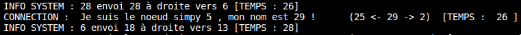
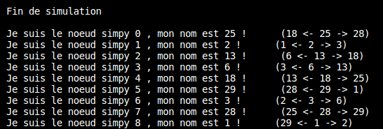

# Rapport de projet INFO833 Systèmes distribués à large échelle Implémentation d'une DHT

## Présentation du projet
### Généralités
Le but de projet est de commencer l'implémentation une DHT à l'aide d'un simulateur. 
Parmi les deux simulateurs les plus courants, PeerSim et SimPy, nous avons choisi d'utiliser SimPy car nous sommes plus à l'aise avec le langage python. 

### Orientation et objectifs
Nous avions une liberté accordée sur l'orientation du projet. Nous avons décidé de le réaliser par étapes, de manière propre et efficace, quite à ne pas avancer dans les fonctionnalités développées. 

### Fonctionnalité du programme
À l'heure actuelle, notre programme est capable de lancer une DHT qui contient 3 noeuds interconnectés. Il est ensuite possible d'insérer de nouveaux noeuds dans la DHT. C'est pour l'heure le seule fonctionnalité opérationnelle dans le programme.

### Architecture du programme
Pour réaliser cette DHT, nous avons construit deux classes :
<ul>
<li>Une classe <b>Dht</b>, sans paramètre qui représente la DHT</li>
<li>Une classe <b>Node</b>, pour représenter les noeuds, qui contient (en plus des éléments nécessaires à la simulation) : 
    <ul>
    <li>Un booléan <b>connected</b> mis à True lorsque le noeud est connecté à la DHT,</li>
    <li>Un indentifiant <b>id_simpy</b>, qui sert d'identifiant pour la simulation, </li>
    <li>Un identifiant <b>id_node</b>, qui sert à placer le noeud dans la DHT, </li>
    <li>Un drapeau (<b>flag</b>), pour "annoncer" que le noeud est en train de réaliser une insertion, et qu'il ne peut pas gérer d'autres requêtes</li>
    <li>Une liste <b>queue</b> pour stocker les prochaines requêtes à traiter</li>
    <li>Un noeud <b>entree_dht</b> auquel le noeud va faire une requete pour se connecter à la DHT</li>
    <li>Deux voisins, de type noeuds, un à droite et à un gauche, pour assurer la connexion de la DHT</li>
    </ul>
</li>
</ul>

Enfin, un fichier main permet de lancer la simulation.

### Utilisation du programme
Pour utiliser le prgramme, il convient de modifier la méthode <i>start</i> de la classe Dht. En dessous des 3 premiers noeuds créés (n0, n1 et n2), vous pouvez en créer d'autres (comme c'est déjà fait) pour les ajouter à la DHT. Vous pouvez ensuite les ajouter à la liste <b>array_node</b>, cela servira pour l'affichage final, nous y reviendrons plus tard.

Pour lancer la  simulation, exécuter le fichier <i>main.py</i>.

### Suivi de la simulation et affichage des logs
Au cours de la simulation, des logs s'affichent dans la console pour en suivre le déroulé. Voici un exemple de log que vous pouvez trouver : 

Comme vous pouvez le constater, il existe 2 types de logs : 
<ul>
<li>Les logs de <b>CONNECTION</b> qui annoncent qu'un noeud vient de se connecter à la DHT. On retrouve ses deux identifiants, ses deux voisins actuels ainsi que le temps actuel de la simulation.</li>
<li>Les logs <b>INFO SYSTEM</b> qui fournissent des informations, dans le cas présent des mesaegs entre des noeuds. Lorsque qu'on noeud essaie de se conncecter à la DHT, il fait la requête à un noeud connecté. Si le noeud connecté de trouve pas de place pour insérer le nouveau venu, il fait parvenir la requête à l'un de ses voisins (le plus pertient). Ce sont ces "passages de requêtes" qui sont loggés. On retrouve le noeud qui envoie la requête, le noeud à connecter (qui demande la connexion) et le destinaire ainsi que le temps de la simulation.
</ul>

<b>Remarque</b> : Lorsque le noeud de départ est identique au noeud à connecter, cela signifie que c'est le premier 'saut' de la requête.

Lorsque la simulation se termine, le programme affiche tous les noeuds théoriquement présents dans la DHT (d'ou l'intérêt de les ajouter dans la liste <b>array_node</b> de la classe Dht). Cela permet de vérifier que tous les noeuds possèdent bien des voisins (à défaut, le programme crash) et que ces voisins sont corrects.

Voici, ci-dessous, un exemple de cet affichage, ou l'on constate que tout à bien fonctionné.

Ce résultat permet de faire une remarque importante : presque tous les cas sont gérés. Cela a fait partie de nos difficultés principales, mais il est possible d'insérer des noeuds dont l'identifiant est plus petit ou plus grand que l'ensemble des identifiants des noeuds déjà connectés à la DHT. Le seul cas qui n'est pas géré, et le cas ou l'on souhaite connecter un noeud dont l'identifiant se trouve déjà dans la DHT. Cette problématique a été volontairement mise de côté.

### La gestion du temps
Nous avons fait le choix de ne pas totalement contrôler les simulations que nous lancions. Il y a une part d'aléatoire dans les délais simulés. On espère ce cette manière, obtenir différentes configurations ou dispositions pour repérer les bugs et rendre la simulation plus réaliste. Nous avons toutefois mis des délais courts pour les trois premiers noeuds que nous connectons "manuellement" pour être sûr que la DHT initiale soit en place avant que les autres noeuds ne viennent faire des requêtes de connexion.

Il suit que les simulations ne sont pas reproductibles et que chaque nouveau lancement aboutira à un résultat différent. Nous sommes conscients que, dans un contexte de recherche ou d'étude sérieuse, ce comportement est à éviter, mais dans le cadre de ce projet nous nous en accomondons.

### Les difficultés rencontrées
Tout d'abord, il n'a pas été facile de prendre en main la bibliothèque Simpy, il nous a fallu, avant de commencer le projet, réaliser plusieurs tutoriels pour en comprendre les mécaniques et principes.

Dans un second temps, il a été compliqué de se mettre à réfléchir "de manière distribuée". Le démarrage n'était pas facile et nous ne savions pas tellement par quoi commencer. Une fois cette difficulté franchie, les choses ont été facilitées.

Enfin, la prise en compte de tous les scénarios possibles, en évitant les formes de "triche" faisait aussi partie de nos principaux obstacles lors de ce projet.

### Conclusion
En tout premier lieu, ce projet nous a beaucoup intéressé, autant l'un que l'autre, nous nous y sommes investi, ce qui était plaisant. De plus, il nous a beaucoup appris, sur les simulateurs à événements discrets d'abord, et sur la façon de programmer de manière distribuée ensuite, qui nécessite une manière de penser particulière. Même si nous n'avons pas développpé beaucoup de fonctionnalités, nous sommes très fier ce de projet et espérons pouvoir le poursuivre par nous-mêmes dans la suite.

